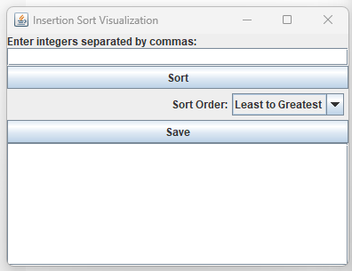

# NumberSort

Welcome to the Insertion Sort Visualization program!

## Description

This program allows you to enter a list of integers separated by commas. You can choose to sort the list in ascending order (least to greatest) or descending order (greatest to least). The sorted list will be displayed visually after each iteration of the insertion sort algorithm.

## Usage

1. Enter a list of integers separated by commas into the input field.
2. Select the desired sorting order from the dropdown menu.
3. Click the "Sort" button to start the sorting process.
4. Optionally, click the "Save" button to save the sorted list to a text file.

## License

This project is licensed under the [GNU General Public License]

## Contributing

Contributions are welcome! Please fork the repository, make your changes, and submit a pull request.

## Authors

- Just Another Dev

## Feedback

If you have any feedback or suggestions, please feel free to open an issue on GitHub.
